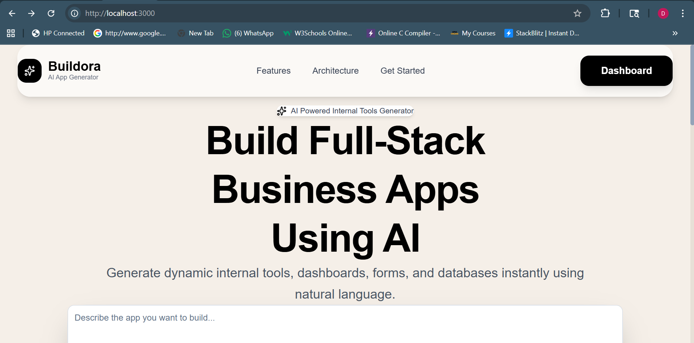
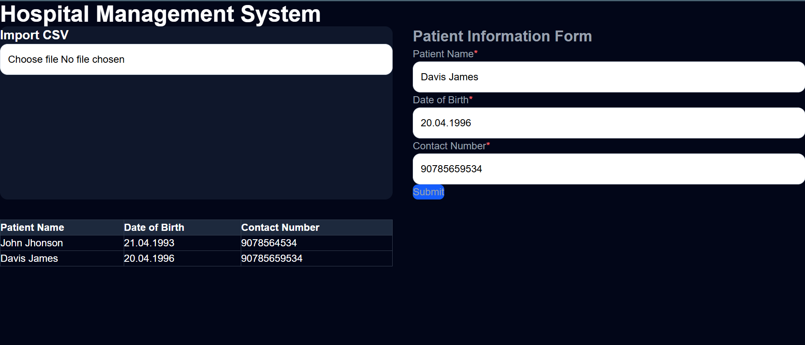
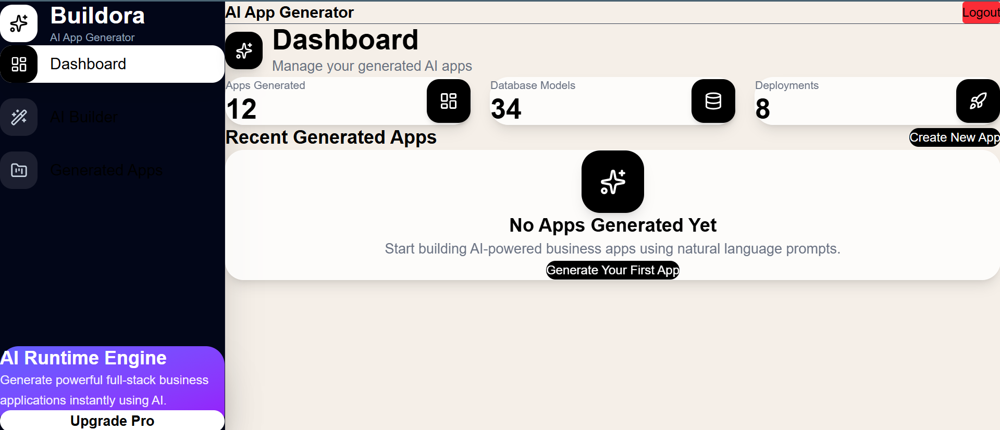
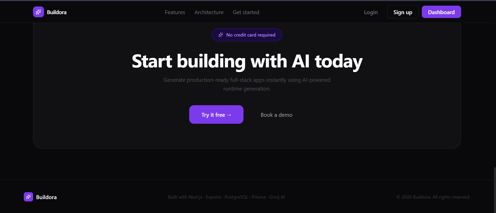
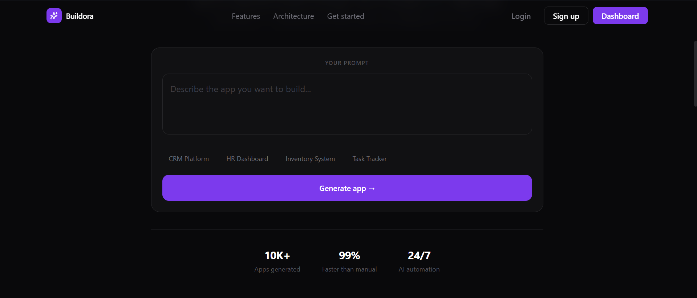
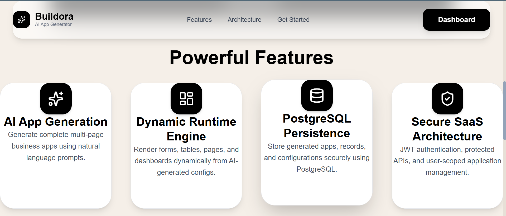
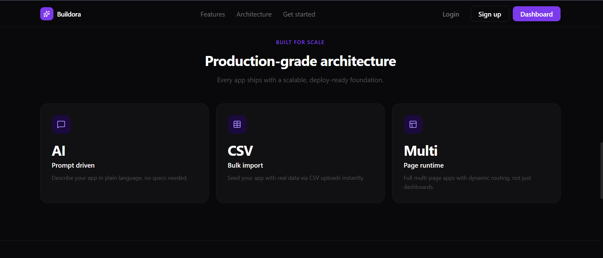

# 🚀 Buildora — AI Powered Internal Tools Generator

<p align="center">

  

</p>

<p align="center">

  <strong>
    Build full-stack business applications instantly using AI prompts and dynamic JSON configurations.
  </strong>

</p>

<p align="center">

  AIForge transforms natural language + JSON schemas into powerful internal tools with dynamic forms, tables, dashboards, CSV import/export, and runtime-generated pages.

</p>

---

# ✨ Features

## 🧠 AI App Generation

Generate dynamic internal tools using prompts or JSON configurations.

- Dynamic page generation
- Runtime schema rendering
- AI-ready architecture
- Multi-page application support

---

## 📋 Dynamic Forms & Tables

Buildora automatically generates:

✅ Forms  
✅ Tables  
✅ CRUD-ready layouts  
✅ Dynamic field rendering

from uploaded JSON configs.

<p align="center">

  

</p>

---

## 📊 Beautiful Dashboard

Modern SaaS-inspired dashboard UI with:

- App analytics
- Generated apps overview
- Runtime engine
- Deployment stats

<p align="center">

  

</p>

---

## ⚡ AI Runtime Engine

Generate scalable internal business platforms dynamically.

<p align="center">

  

</p>

---

## 📂 CSV Import Support

Bulk import records directly into generated applications.

- CSV parsing
- Dynamic table population
- Runtime validation

---

## 🔐 Authentication System

Secure authentication with:

- JWT Auth
- Protected Routes
- Login & Signup
- Persistent sessions

---

# 🖥️ Landing Page

Modern responsive landing page inspired by premium AI SaaS products.

<p align="center">

  

</p>

---

# 🎯 Prompt Based Generation

Users can describe applications using prompts.

<p align="center">

  

</p>

---

# 🌟 Powerful Features Section

<p align="center">

  

</p>

---

# 📈 Stats & Runtime Scaling

<p align="center">

  

</p>

---

# 🏗️ Architecture

## Frontend

- Next.js 15
- TypeScript
- Tailwind CSS
- Context API
- Axios

## Backend

- Express.js
- Prisma ORM
- PostgreSQL
- JWT Authentication
- Groq AI SDK

---

# ⚙️ Tech Stack

| Frontend | Backend | Database | AI |
|---|---|---|---|
| Next.js | Express.js | PostgreSQL | Groq |
| TypeScript | Node.js | Prisma ORM | LLM APIs |
| Tailwind CSS | JWT Auth | Render DB | AI Runtime |

---

# 📂 Project Structure

```bash
AIForge/
│
├── client/
│   ├── app/
│   ├── components/
│   ├── services/
│   ├── context/
│   └── types/
│
├── server/
│   ├── src/
│   ├── routes/
│   ├── controllers/
│   ├── prisma/
│   └── middleware/
│
└── docs/
    └── screenshots/
```

---

# 🚀 Getting Started

## 1️⃣ Clone Repository

```bash
git clone https://github.com/yourusername/aiforge.git
```

---

## 2️⃣ Install Frontend

```bash
cd client
npm install
```

---

## 3️⃣ Install Backend

```bash
cd server
npm install
```

---

## 4️⃣ Setup Environment Variables

### Backend `.env`

```env
DATABASE_URL=
JWT_SECRET=
GROQ_API_KEY=
```

---

## 5️⃣ Run Backend

```bash
npm run dev
```

---

## 6️⃣ Run Frontend

```bash
npm run dev
```

---

# 📦 Deployment

## Frontend

Deploy on:

- Render

## Backend

Deploy on:

- Render

---

# 🔥 Future Improvements

- AI prompt → JSON auto generation
- Drag & drop builder
- Theme customization
- Workflow automation
- Multi-user collaboration
- Realtime database sync

---

# 👨‍💻 Author

### Diptadeep Sinha

B.Tech CSE Student • Full Stack Developer • AI Builder

---

# ⭐ Support

If you liked this project:

⭐ Star the repository  
🍴 Fork the project  
🚀 Build your own AI platform

---

# 🧠 Inspiration

Buildora is inspired by the future of:

- Retool
- Appsmith
- Lovable
- Bolt.new
- Internal developer platforms powered by AI

---

# 📜 License

MIT License © 2026 AIForge
